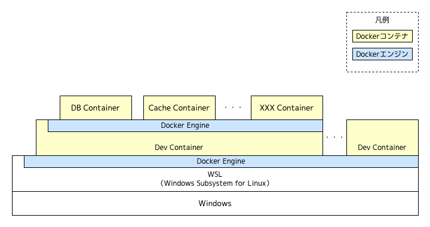
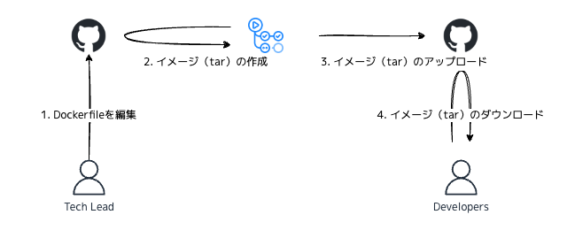

# エンタープライズな現場で実現するモダンな開発環境構築（WSL2 + VSCode Dev Containers）

## はじめに

[Future Advent Calendar 2024](https://qiita.com/advent-calendar/2024/future) の 18 日目のエントリです。

テックリードとしてチームの開発メンバにどのように開発環境を提供するかというのは重要なテーマです。
本記事では筆者がエンタープライズな現場において実践している環境構築方法について紹介します。あくまで 1 つの事例としてお読みください。

## 前提

- VSCode で開発可能な Web アプリケーションの開発を想定
- 開発者は 20 名から 50 名程度、技術スキルは新人などのジュニアなメンバからシニアなメンバまでさまざま
- 開発者は異なる現場でも開発をしており、開発マシンは同じものを使用
- 開発マシンは基本 Windows、一部 macOS ユーザも想定

## 達成したいこと

- 開発環境の構築にかかる作業時間を短縮したい
- 全員が同じ環境を再現可能な状態にしたい（= 環境差異によるトラブルを最小化したい）
- ホストマシンをクリーンな状態に保ちたい
- 開発環境の破棄、再構築を手軽に行いたい

## 開発環境の全体像



タイトルにも記載の通り、 Windows Subsystem for Linux（WSL）と VSCode Dev Containers を利用して開発環境を構築しています。

## WSL2 の導入

Windows ユーザの開発環境の土台として WSL を導入します。

### 導入の目的

- **コンテナを活用した開発の実現**
  WSL2 では完全な Linux カーネルが搭載されているため、Docker をネイティブに実行でき、VSCode Dev Containers をはじめとしてコンテナを活用した開発が実現できます。

- **ホスト環境との分離**
  ホスト側の Windows 環境とは分離された環境になるため、Windows 環境で使用していた開発ツールのバージョンや設定などのコンフリクトを気にせずクリーンな環境が整備できます。

### 導入上のポイント

#### 1. WSL2 のイメージのビルド

[Microsoft Store](https://www.microsoft.com/en-us/search/shop/apps?q=linux) で配布されている Linux ディストリビューションを素で利用するのではなく、あらかじめセットアップ（必要なソフトウェアのイントールなど）したカスタムイメージを作成して配布しています。
[公式ドキュメント](https://learn.microsoft.com/ja-jp/windows/wsl/use-custom-distro) でも紹介されていますが、WSL のイメージは Docker コンテナを使用して tar ファイルを取得することで任意のものを作成可能です。
ざっくりとしたイメージの作成手順は次の通りです。

1. `Dockerfile` に必要なソフトウェアのインストールなどのセットアップ内容を記述
2. `docker build` でコンテナイメージを作成
3. `docker run` でコンテナを実行
4. `docker export` を使ってコンテナから WSL2 にインポート可能な `tar` ファイルを作成

セットアップ内容の一例は次の通りです。

- Docker のインストール
- Git のインストール
- ローカルプロキシのインストール（後述）
- 各種設定（環境変数、プロファイルなど）

個々のアプリケーション開発に必要なランタイム等は後述する Dev Container 側で整備するため、ここではあくまで土台として必要なものだけをセットアップします。

#### 2. WSL2 のイメージの配布

このイメージに頻繁に変更が入ることはあまり想定されませんが、ビルドから配布まで自動化された CI/CD パイプラインが整備されていることが望ましいでしょう。



Dockerfile 等のイメージの作成に必要なファイルは専用のリポジトリで Git 管理し、GitHub Actions と統合することで CI/CD パイプラインを実現します。
この手の成果物は [Release Please](https://github.com/googleapis/release-please) などのリリース管理ツールとの相性が非常によく、CHANGELOG の生成やバージョニングを自動化したうえで、成果物である `tar` ファイルを Release Artifact として紐づける運用が効果的です。

#### 3. ローカルプロキシの導入

多くの企業では、セキュリティ対策の一環として認証プロキシを導入しています。
認証プロキシは社内のネットワークからインターネットへのアクセスを制御し、不正なアクセスや情報漏洩を防ぐための重要な手段です。
しかしながら開発環境構築する上で、認証プロキシは次の通り非常に煩雑なものとなります。

- 各ソフトウェアごとにプロキシの設定が必要であり、設定漏れや誤設定が発生しやすい
- 認証プロキシに対応していないソフトウェアが存在する
- プロキシ周りの問い合わせを受けた際に、切り分けしづらい（認証プロキシのユーザ名やパスワードが設定ファイルに書かれる場合が多く、うっかり設定ファイルを開かないよう気を遣いながら切り分ける必要がある）

ローカルプロキシを導入することで、認証情報を一限管理し、上記の課題を解決できます。
ローカルプロキシにはいくつか利用可能なソフトウェアがありますが、その中でも mitmproxy の具体的なセットアップ手順は [こちらの記事](https://future-architect.github.io/articles/20240227a/) が参考になります。

## Dev Containers の導入

[VSCode Dev Containers](https://code.visualstudio.com/docs/devcontainers/containers) を導入して Docker コンテナで開発環境を構築します。

### 導入の目的

- **開発環境の統一**
  開発者全員が同じコンテナ環境で作業することで、ランタイムやツールのバージョン差異による問題を解消し、一貫性のある環境を提供できます。

- **セットアップ時間の削減**
  開発を始めるために必要なランタイムやツール、VSCode の拡張機能のインストールや設定を自動で行えるため、セットアップを迅速に行うことができます。

- **プロジェクトごとに独立した開発環境**
  セットアップしたものはコンテナ内に閉じたものであり、プロジェクト（例. Git リポジトリ）単位に環境を切り替えることができます。VSCode の拡張機能や設定についても、ホスト上や WSL 上で起動する VSCode には影響を与えません

- **OS 非依存の開発環境**
  Windows、macOS、Linux のいずれの OS でも同じコンテナ環境で開発ができるため、OS ごとの互換性問題を排除できます。

- **拡張機能や設定の自動適用**
  VSCode の拡張機能やエディタ設定を開発者がマニュアルで設定することなく自動適用できます。またこの設定はホスト上、WSL 上で起動する VSCode には影響を与えないため、コンテナの単位でクリーンに拡張機能や設定を保つことができます。

- **CI/CD パイプラインとの整合性**
  Dev Container の環境と CI/CD 環境（例. Docker ベースのジョブ）を合わせることで、CI/CD 環境との動作差異が少なくなり、ビルド・デプロイ時のトラブルを削減できます。

### 導入上のポイント

#### 1. Dev Container の使い分け

モノレポ構成により 1 リポジトリにフロントエンドとバックエンドのソースが混在するケースなどにおいて、Dev Container を分けたくなることがあります。
この場合 `.devcontainer` ディレクトリ配下にサブディレクトリを設けることで、複数の `devcontainer.json` を管理し、起動する Dev Container を VSCode 上で選択できます。

筆者のチームでは、同一の開発者がフロントエンドやバックエンドの垣根なく開発を実施するため、単一の Dev Container 構成としています。このあたりはチームの状況に応じて使い分けると良いでしょう。

#### 2. DinD or DooD

Dev Container とは別に、開発用のデータベースやモックサーバなどをコンテナで起動することが多くあります。コンテナの立て方としてホスト（今回の場合は WSL）側とは完全に独立した Docker デーモンを Dev Container 内に立てる Docker in Docker（DinD）方式とホスト側の Docker デーモンを利用する Docker outside of Docker（DooD）方式があります。

| 項目               | DinD (Docker in Docker)                 | DooD (Docker outside of Docker)          |
| ------------------ | --------------------------------------- | ---------------------------------------- |
| **パフォーマンス** | オーバーヘッドがある（遅い）            | 高速（ホストデーモンを直接利用）         |
| **環境の独立性**   | 完全に独立した Docker 環境              | ホストの Docker 環境に依存               |
| **リソース効率**   | 低い（Docker デーモンのオーバーヘッド） | 高い（ホストのリソースをそのまま利用）   |
| **競合リスク**     | 低い（隔離されているため）              | 高い（コンテナ名やポートの競合の可能性） |

複数の Dev Container を立ち上げる前提のもと、名前やポートの競合を懸念して DinD 方式を採用しました。
しかし、あらためて考えると、DB などのサポートコンテナ群はパフォーマンスの観点等から DooD 方式の方が適している可能性が高いです。

## トラブルシューティング

実際に運用する中でてきたいくつかのトラブルシュートを紹介します。

### **WSL の DNS トンネリングが効かない**

WSL の DNS Tunnel 機能は Windows11（22H2）以降のバージョンの OS が必要なため、Windows10 ユーザは個別に DNS を設定してもらう必要がありました。
<https://learn.microsoft.com/en-us/windows/wsl/wsl-config#experimental-settings>

### プロキシの設定がうまくいかない

プロキシとの戦いは果てしないものがあります。
今回ローカルプロキシを導入したことで、認証情報を個々のファイルに記載する必要はなくなりましたが、各所でプロキシの設定が必要になります。

#### Dev Containers のコンテナイメージの PULL

Docker イメージを PULL する際には、ホスト（WSL）側の　[Docker デーモンのプロキシ設定](https://docs.docker.com/engine/daemon/proxy/) が必要になります。

#### Dev Container Features のインストール

Features のインストールは、Docker ビルドの一部として行われます。
`devcontainer.json` の `build.args` にプロキシを設定することで、プロキシを有効にできます。なお `localEnv` を利用することでホスト側の環境変数を参照できるため、ホスト側のプロキシ設定をそのまま参照させたい場合は便利です。

```json:devcontainer.json
{
  "build": {
    "dockerfile": "Dockerfile",
    "args": {
      "http_proxy": "${localEnv:http_proxy}",
      "HTTP_PROXY": "${localEnv:HTTP_PROXY}",
      "https_proxy": "${localEnv:https_proxy}",
      "HTTPS_PROXY": "${localEnv:HTTPS_PROXY}",
      "no_proxy": "${localEnv:no_proxy}",
      "NO_PROXY": "${localEnv:NO_PROXY}"
    }
  }
}
```

もしくは [Docker クライアントのプロキシを設定](https://matsuand.github.io/docs.docker.jp.onthefly/network/proxy/#configure-the-docker-client) することでも対応できると思われます。（未検証）
ただし、この設定はビルド時およびすべての起動したコンテナに反映されます。スコープを絞りたい場合は `devcontainer.json` 内で指定する形が望ましいでしょう。

なお、プロキシの独自証明書のインストールが必要な場合は、`Dockerfile` 内で真っ先に証明書のインストールを行うと良いでしょう。

```Dockerfile:Dockerfile
FROM mcr.microsoft.com/devcontainers/base:bullseye

# Update CA certificates.
COPY certs/* /usr/local/share/ca-certificates/
RUN update-ca-certificates
```

#### VSCode 拡張機能のインストール

VSCode の拡張機能をインストールする場合は、`devcontainer.json` の `containerEnv` にプロキシの設定が必要となります。似たような項目に `remoteEnv` がありますが、こちらは VSCode の Remote Server プロセスが利用する環境変数となるため、こちらではうまくいきません。コンテナ全体のプロセスに有効な `containerEnv` を指定する必要があります。

なお、拡張機能インストール時に独自証明書を参照させたい場合は、`NODE_EXTRA_CA_CERTS` を設定する必要があります。

```jsonc:devcontainer.json
{
  "containerEnv": {
    "http_proxy": "${localEnv:http_proxy}",
    "HTTP_PROXY": "${localEnv:HTTP_PROXY}",
    "https_proxy": "${localEnv:https_proxy}",
    "HTTPS_PROXY": "${localEnv:HTTPS_PROXY}",
    "no_proxy": "${localEnv:no_proxy}",
    "NO_PROXY": "${localEnv:NO_PROXY}",
    // For VSCode Extensions in the dev container.
    "NODE_EXTRA_CA_CERTS": "/etc/ssl/certs/ca-certificates.crt"
  }
}
```

#### そのほか各種ツールのプロキシ設定

環境変数を見てくれない各種ツールのプロキシ設定（例. Git の SSH プロキシ、Maven のプロキシなど）は、コンテナ作成後に `onCreateCommand` 等のライフサイクルスクリプトを利用して個別に設定します。

`sudo` を利用してシステムパッケージのアップデートやインストールしている場合（例. `sudo apt-get update`）は、環境変数が引き継がれるよう `env_keep` の設定もしくは `-E` オプションの指定が必要なのでご注意ください。

## その他

### Docker コンテナ上での開発は重いのか

Docker の I/O オーバーヘッドが大きいという意見はその通りです。

<https://x.com/mizchi/status/1860921036524376516>

筆者のチームでは、現状システムのサイズがそこまで大きくなく開発者体験を損なうレベルではありません。
開発者が多く、開発者のレベルがさまざまであることを考慮すると、統一された環境を提供する方のメリットが大きいと判断しています。このあたりはチームの状況やシステムの特性に応じてトレードオフを意識しながら判断するのが良いでしょう。

できることとしては最低限 `node_modules` などの書き込みパフォーマンスが重要なパッケージフォルダやデータフォルダはバインドマウントをするのではなく、名前付きのローカルボリュームにマウントすることは必須です。

```json:devcontainer.json
{
  "mounts": [
    "source=${localWorkspaceFolderBasename}-node_modules,target=${containerWorkspaceFolder}/node_modules,type=volume"
  ]
}
```

[公式ドキュメント](https://code.visualstudio.com/remote/advancedcontainers/improve-performance) ではほかにもいくつかディスクパフォーマンスの改善案が紹介されているので、参考にすると良いでしょう。

### WSL のイメージのアップデートをどのように実施させるか

WSL のイメージに更新が入った場合に、どのように開発者に WSL イメージをアップデートさせるかはあまりしっかりと考えられていなかったので今後考えたいところです。

現状は Git の config ファイルや SSH 鍵など最低限のバックアップとリストア用のスクリプトを用意している形になります。Ansible などを導入して、更新情報はそちらで管理する方法もありますが、極力イミュータブルな世界にしたいという想いもあり、いかにシームレスにアップデートを行わせるか悩ましいところです。

## 終わりに

本記事では、WSL2 と VSCode Dev Containers を活用したモダンな開発環境の構築手法について紹介しました。
開発環境はチーム全体の生産性に大きく影響する重要な要素です。本記事の内容が、皆さんの現場でも役立ち、より効率的で快適な開発環境の実現につながれば幸いです。
