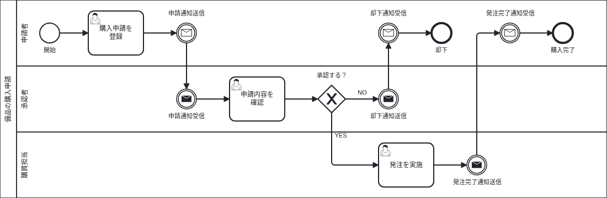
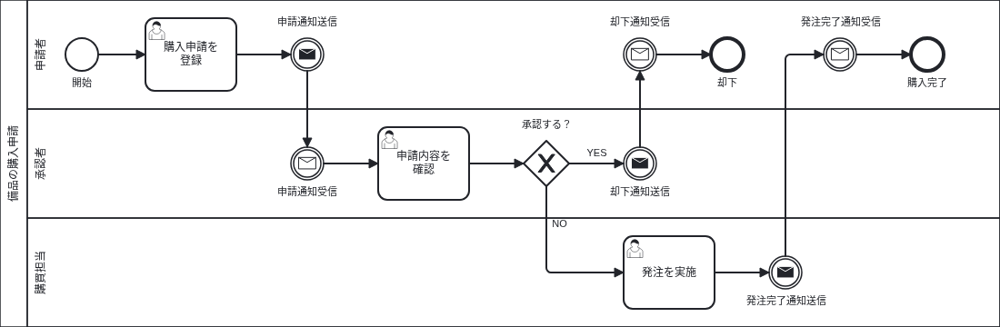

# bpmn.io で始める AI-Ready な業務フロー管理

## はじめに

みなさんは業務フローを書いたことはあるでしょうか。

業務フローは、ある業務を誰がどの順番で進めるかを図にしたものです。申請者が申請を登録し、承認者が承認し、購買担当が発注する、といった手順を担当者ごとのレーンに分け、矢印でつなぎます。システムの開発現場ではグランドデザインや要件定義などの工程で作られることが多い成果物です。

書く目的は、業務の手順を関係者の間でそろえることです。業務を担当する人とシステムを作る人とでは、同じ業務名から思い浮かべる手順が違います。業務フローとして描き出すと、どこで人が判断し、どこからシステムが処理するのかという境目について、双方の認識のずれが明らかになります。システム化の範囲を決める作業も機能を洗い出す作業も、この業務フローをインプットとして実施できます。

業務フローは、従来は Excel や PowerPoint をはじめとするオフィス系のツール、最近では draw.io の図として作られるのをよく目にします。しかし、生成 AI に業務フローを扱わせることを考えると、これらの形式がベストとはいえません。これらのファイルに保存されているのは図形の座標やスタイルの情報であり、その図形が業務フローとしてどういう意味を持つのか（たとえば、人の作業なのかシステムの処理なのか）は直接的には含まれていません。生成 AI に扱わせるには、凡例に相当する情報を別途コンテキストとして与えたり、座標やスタイルから推測させたりする必要があり、そのぶんトークンを消費します。生成 AI に読み書きさせるなら、要素の型や要素間の参照といった情報がスキーマに沿って記述され、座標やスタイルの情報によらず直接判断できる形式が望ましいと考えます。

この記事では、AI-Ready な業務フローの記述形式として BPMN 2.0 を採用し、bpmn.io エコシステムを利用して管理する方法を紹介します。取り上げるのはあくまで業務フローの管理の手段であり、業務フローはどうあるべきか、業務をどう改善するかといった部分は含みません。

## 業務フローの記法に何を使うか

業務フローは、これまで組織やプロジェクトごとに独自の形式で書かれることが一般的でした。角丸の四角は人の作業、四角はシステムの処理というように、図形に独自の凡例を定めて記述する形です。

しかしながら、こうした独自の記法を定めなくても、業務プロセスの記法には標準化されたものがあります。BPMN（Business Process Model and Notation）は OMG（Object Management Group）が策定した業務プロセスの記法で、現行版の 2.0.2 は2014年1月に採択され、ISO/IEC 19510 として国際標準にもなっています。仕様は [OMG の公式ページ](https://www.omg.org/spec/BPMN/2.0.2/) で公開されています。

BPMN が定めているのは、図形だけではありません。仕様書は、業務フローを書くための各種要素の意味を定めたうえで、それをファイルに書くときの形式まで XML Schema で定めています。公式ページでは、仕様書の PDF と一緒に次の4つのスキーマファイル（.xsd）が配布されています。

| スキーマ   | 接頭辞 | 定めるもの                                                                           | 例                                                                                          |
| ---------- | ------ | ------------------------------------------------------------------------------------ | ------------------------------------------------------------------------------------------- |
| BPMN20.xsd | bpmn   | プロセスの意味：タスク、イベント、ゲートウェイ、レーンなどの要素と、要素間のつながり | `<bpmn:sequenceFlow id="Flow_2" sourceRef="Task_Register" targetRef="Event_RequestSent" />` |
| BPMNDI.xsd | bpmndi | 図の配置：BPMN20.xsd の各要素を、図のどこにどの図形や線として描くか                  | `<bpmndi:BPMNShape id="Task_Register_di" bpmnElement="Task_Register">`                      |
| DC.xsd     | dc     | 描画の基本型（Diagram Common）：矩形の位置と大きさ、点、フォントなど                 | `<dc:Bounds x="160" y="20" width="100" height="80" />`                                      |
| DI.xsd     | di     | 図の基本構造（Diagram Interchange）：図形や線の抽象的な型と、線の折れ点              | `<di:waypoint x="108" y="60" />`                                                            |

BPMN 2.0 形式のファイル（.bpmn）では、この4つのスキーマに対応する名前空間を宣言します。

```xml
<bpmn:definitions
  xmlns:bpmn="http://www.omg.org/spec/BPMN/20100524/MODEL"
  xmlns:bpmndi="http://www.omg.org/spec/BPMN/20100524/DI"
  xmlns:dc="http://www.omg.org/spec/DD/20100524/DC"
  xmlns:di="http://www.omg.org/spec/DD/20100524/DI"
  id="Definitions_1">
```

このように仕様が細かく定められているため、BPMN に準拠したツールの間には互換性があり、エディタ、静的解析、画像変換といったツールのエコシステムも形成されています。

## BPMN エディタは何を使うか

BPMN に準拠した業務フローを描くためのエディタとしては draw.io と bpmn.io が代表的です。

draw.io には BPMN の図形ライブラリがあり、BPMN の記法で図をすぐに描けます。ただし、保存されるファイルは draw.io 独自の mxGraphModel 形式の XML で、図形の座標とスタイルが書かれているだけです。ユーザタスクとサービスタスクの区別や、メッセージを送るイベントと受けるイベントの区別といった BPMN としての意味情報は、スタイル文字列の中にしかありません。BPMN 2.0 形式でのエクスポート要望は [GitHub Issue](https://github.com/jgraph/drawio/issues/5560) に上がっていますが、対応予定なしとしてクローズされています。

[bpmn.io](https://bpmn.io/) は Camunda が開発しているオープンソースの BPMN ツール群です。中心となる bpmn-js は、BPMN の図をブラウザで表示・編集するための JavaScript ライブラリで、保存されるファイルは BPMN 2.0 仕様に準拠した XML です。bpmn-js を組み込んだ VS Code 拡張も公式に用意されていて、.bpmn ファイルを VS Code 内で開いて GUI で編集できます。同じ組織が bpmnlint（静的解析）と bpmn-to-image（画像変換）も公開しています。

2つを比べると、次のようになります。

| 観点                   | draw.io                        | bpmn.io                        |
| ---------------------- | ------------------------------ | ------------------------------ |
| 保存形式               | 独自形式（mxGraphModel）       | BPMN 2.0 XML                   |
| VS Code 拡張           | あり                           | あり                           |
| BPMN の意味情報        | スタイル文字列に埋め込まれる   | 要素の型として保持される       |
| 静的解析               | 不可                           | 可能（bpmnlint）               |
| 画像出力               | 可能                           | 可能（bpmn-to-image）          |
| エディタとしての使用感 | 描きやすい                     | draw.io にはやや劣る           |
| 生成 AI との親和性     | 意味を図形の配置から推測させる | 意味を要素名からそのまま読める |

実際に両方を使用してみると、ページ設定やグリッドなどをはじめ作図エディタとしての使いやすさは draw.io のほうが上だと感じましたが、次の点で bpmn.io のメリットが大きいと判断しています。

- **BPMN 2.0 仕様準拠**  
  保存されるファイルが BPMN 2.0 の XML そのものであり、仕様に違反する操作の一部はエディタが受け付けません。たとえば、同じプールの中の要素どうしは、メッセージフローではつなげません。draw.io は汎用の作図ツールであり、BPMN として無効な図でも描けてしまいます。

- **静的解析可能**  
  .bpmn ファイルは bpmnlint で検査でき、開始イベントの欠落やつながっていない要素を編集時やレビュー時に検出できます。CI への組込みも容易です。

- **生成 AI フレンドリ**  
  業務の意味が `bpmn:userTask` や `bpmn:sequenceFlow` といった仕様上の要素名で書かれているので、生成 AI は図形の配置から推測しなくても、XML から業務フローの構造を読み取れます。誤りを指摘させるだけでなく、修正案を XML の差分として出力させることもできます。

## .bpmn ファイルの中身

bpmn.io で描いた業務フローは、次のような XML になります。この記事のサンプルとして用意した、備品の購入申請のフローから一部を抜き出して見てみましょう。


```xml
<bpmn:userTask id="Task_Register" name="購入申請を&#10;登録">
  <bpmn:incoming>Flow_1</bpmn:incoming>
  <bpmn:outgoing>Flow_2</bpmn:outgoing>
</bpmn:userTask>
<bpmn:intermediateThrowEvent id="Event_RequestSent" name="申請通知送信">
  <bpmn:incoming>Flow_2</bpmn:incoming>
  <bpmn:outgoing>Flow_3</bpmn:outgoing>
  <bpmn:messageEventDefinition id="MessageEventDefinition_1" />
</bpmn:intermediateThrowEvent>
<bpmn:intermediateCatchEvent id="Event_RequestReceived" name="申請通知受信">
  <bpmn:incoming>Flow_3</bpmn:incoming>
  <bpmn:outgoing>Flow_4</bpmn:outgoing>
  <bpmn:messageEventDefinition id="MessageEventDefinition_2" />
</bpmn:intermediateCatchEvent>
```

要素名を読むと、「購入申請を登録」がユーザタスク（人がシステムを操作して行う作業）で、「申請通知送信」はメッセージを送る側の中間イベント、「申請通知受信」は受ける側だと分かります。

図としての見え方は、同じファイルの後半に BPMN DI（Diagram Interchange）として書かれます。

```xml
<bpmndi:BPMNShape id="Task_Register_di" bpmnElement="Task_Register">
  <dc:Bounds x="160" y="20" width="100" height="80" />
</bpmndi:BPMNShape>
```

意味と座標が別の要素に分かれ、それぞれ仕様に定められた形で書かれているので、bpmnlint と生成 AI はどちらも座標を読み飛ばして意味の部分だけを扱えます。

## ガイドラインとして定めるべきこと

記法やツールを決めても、業務フローとして何を書くか（たとえば、どの粒度でタスクを切るか、レーンに何を並べるか）が決まるわけではありません。最低限、業務フローを書く前に定めておくべきポイントを3つ取り上げます。

### 記法のレベル

1つめは、どの種類の記号まで使うかという記法のレベルです。BPMN 2.0 仕様は、使える要素に応じて Descriptive（記述）、Analytic（分析）、Common Executable（実行可能）の3つの適合サブクラスを定めています。業務担当者との合意に使うのか、例外まで含めて分析するのか、ワークフローエンジンで実行するのかといった目的に応じて、どのサブクラスの範囲で描くかを選びます。

### タスクの粒度

2つめは、1つのタスクで業務のどの大きさを表すかというタスクの粒度です。粒度のフレームワークとしては、企業情報化協会（BPM-J）が公開している [機能階層（FL: Function Layer）](https://www.bpm-j.org/download/bpmmodel.pdf) を利用できます。具体的には、次のような階層が目安とともに定義されており、目的に応じてどの階層の粒度で業務フローを作成するかを決めます。

| 階層 | 名称         | 具体的目安                                                        | 目安/例                                                                                                                |
| :--- | :----------- | :---------------------------------------------------------------- | :--------------------------------------------------------------------------------------------------------------------- |
| FL0  | 事業単位     | 事業単位または全社管理                                            | -                                                                                                                      |
| FL1  | 事業機能     | 事業の基本機能                                                    | 商品開発や営業などバリューチェーン機能区分が粒度の目安                                                                 |
| FL2  | 詳細事業機能 | 事業機能の構成要素                                                | 商品やサービスの開発区分、チャネル区分、営業方式、サービスメニューなどが粒度の目安                                     |
| FL3  | 業務機能     | 詳細事業機能の実行単位                                            | オーダーサイクル（受付、計画、実行、報告）、管理、企画の区分などカウンタブルな（数えられる）仕事が粒度の目安           |
| FL4  | 詳細業務機能 | 詳細事業機能の構成要素                                            | 業務機能のマイルストーン、中間成果物確定単位、組織間のハンドオフが粒度の目安                                           |
| FL5  | 単位作業     | 担当レベルの役割単位                                              | 担当レベルの役割単位でのハンドオフが粒度の目安（タスクリストに表示される一件）                                         |
| FL6  | 要素作業     | 単位作業の作業ステップ                                            | 「何を使って何をする」をツール・メディアに着目して区分した連続する操作・動作の塊が粒度の目安（作業分析の時間計測単位） |
| FL7  | 単位操作     | 要素作業を分解した機能の区分                                      | ファイルを開く、選ぶ、コピー&ペーストするなど                                                                          |
| FL8  | 要素操作     | 単位操作を行う人や RPA の動きを特定するための最も詳細な操作・動作 | クリックする、マウスをドラッグする、○秒待つなど                                                                        |

システム化を前提に詳細化する場合は、1つの業務フローを FL4-5、FL5-6 の粒度で描くことが多くなります。

### 記述ルール

3つめは記述ルールそのものです。まず使えるのは BPMN 仕様の規定で、「開始イベントは流入シーケンスフローを持てない（§10.5.2）」というようなものが挙げられます。

ただし、仕様が定めるのは BPMN として正しいかどうかであり、読みやすい図にするためのルールは定めていません。そこを補うのが Bruce Silver の「BPMN Method and Style」（M&S）のスタイルルールです。M&S は、図だけを見て業務の流れが読み取れる BPMN を描くためのメソッドで、「アクティビティ名は目的語と動詞で書く」「ゲートウェイのラベルは問いの形にする」といったルールをまとめています。なお、M&S は書籍として出版されているものであり、オープンに公開されてはいない点に注意が必要です。

仕様と M&S で足りない部分は、独自に定めておくのが望ましいでしょう。たとえば bpmn.io にはページ設定がないので、複数のフローの見た目と出力サイズをそろえるには、次のようにレイアウトを数値で決めておくことになります。

- プールは起点 (0, 0)、横幅1820で描く
- レーン1本の高さは120とする
- タスク間の水平間隔は60とする
- 主フローは左から右へ流し、分岐と合流は上下に展開する

ルールごとに出典（仕様、M&S、独自）を明記しておくと、レビューで根拠を示しやすくなります。

## bpmnlint による静的解析

bpmnlint は、.bpmn ファイルを検査するコマンドラインツールです。ESLint と同じ作法で、設定ファイル `.bpmnlintrc` に `extends` でルールセットを継承し、`rules` で個別に上書きします。

```json
{
  "extends": "bpmnlint:recommended"
}
```

`bpmnlint:recommended` には25のルールが入っています。開始イベントと終了イベントがあるか、すべての要素にラベルがあるか、どこにもつながっていない要素がないか、排他ゲートウェイから出る複数のフローに条件が付いているか、といった検査です。

購入申請フローを規約違反のある状態にして実行してみます。「発注を実施」タスクの名前を入れ忘れ、その先の「発注完了通知送信」につなぐ矢印も引いていない状態で bpmnlint を実行すると次のような出力が得られます。

```text
$ npx bpmnlint docs/purchase_request_draft/purchase_request_draft.bpmn

./docs/purchase_request_draft/purchase_request_draft.bpmn
  Task_Order         error  Element is missing label/name  label-required
  Task_Order         error  Element is an implicit end     no-implicit-end
  Event_OrderedSent  error  Element is an implicit start   no-implicit-start

✖ 3 problems (3 errors, 0 warnings)
```

図を見れば分かる誤りですが、こうした記法や構造の誤りを人がレビューで1つずつ確認するのは時間の無駄です。機械的に検出できるものは lint に任せ、レビュアーは業務フローが実際の業務を正しく表しているかという本質的な部分に集中できます。

業務フローの CI というのはあまり耳馴染みがないかもしれませんが、bpmnlint はコマンドラインで動くので、GitHub Actions などの CI に組み込んで Pull Request ごとに検査することも簡単に実現できます。

## 静的解析では検出できないもの

bpmnlint が見ているのは構造です。要素がつながっているか、ラベルがあるか、ゲートウェイの使い方が作法どおりか。フローが業務として正しいかは判定できません。

購入申請フローで、申請通知の送信側と受信側を逆にしてみます。申請者のレーンの「申請通知送信」を受信（キャッチ）イベントに、承認者のレーンの「申請通知受信」を送信（スロー）イベントに変えた版です。図では、手紙のアイコンが塗りつぶしか白抜きかの違いしかありません。



```text
$ npx bpmnlint docs/purchase_request_swapped/purchase_request_swapped.bpmn
（出力なし、終了コード 0）
```

矢印はすべてつながり、ラベルも開始と終了もあるので、構造としては正しく、bpmnlint は何もエラーを出力しません。この誤りはカスタムルールを書けば検出できますが、カスタムルールだけでは検出できない誤りもあります。たとえば承認の可否で分岐するゲートウェイから出る YES と NO を入れ違えてしまったケースです。



```text
$ npx bpmnlint docs/purchase_request_inverted/purchase_request_inverted.bpmn
（出力なし、終了コード 0）
```

承認すると却下通知が送られ、却下すると発注されるという逆のフローですが、当然これも bpmnlint で検出できません。YES の先に何があるべきかは、「承認」と「却下通知」「発注」という語の関係を理解しないと判断できません。

## 生成 AI によるレビュー

ガイドラインとして定めた内容は、そのまま Claude Code の rules などにできます。先ほどの記法のレベル、タスクの粒度、記述ルールの3つを反映した次のルールを `.claude/rules/bpmn.md` に置いておくと、生成 AI は業務フローを扱うたびにこの規約を読み込みます。

```markdown
---
paths:
  - "docs/**/*.bpmn"
  - "docs/**/*.md"
---

# 業務フロー記述規約

（中略）

## 記法のレベル

- 使用する要素は Analytic 適合サブクラスの範囲に限る（BPMN §2.2.2）

## タスクの粒度

- 業務フローは業務（FL4）ごとに1つの BPMN プロセスで表す（FL）
- アクティビティは要素作業（FL6）を目安とする（FL）
- 画面遷移、入力チェックなどのシステム上の条件分岐、クリックなどの操作レベルの動作は描かない（独自）

## 記述ルール

### イベント

- メッセージを送る側は送信（スロー）イベント、受け取る側は受信（キャッチ）イベントで描く（BPMN §10.5.4）
- メッセージイベントのラベルは「〜送信」「〜受信」とし、ラベルと要素の型を一致させる（独自）

### ゲートウェイ

- 質問ラベルを使う場合は、流出するシーケンスフローを YES と NO の2つにそろえる（M&S）
- YES と NO の行き先は、業務として答えの意味と整合させる（独自）

（後略）
```

ガイドラインと同じく項目ごとに出典を添えておくと、生成 AI が指摘するときに、仕様の条番号やスタイルルールといった根拠まで示せます。先ほど説明した2つの誤りも、このルールの「ラベルと要素の型を一致させる」「YES と NO の行き先は、業務として答えの意味と整合させる」に照らせば指摘できます。

このサンプルとは別ですが、実際に書いた業務フローのリポジトリにも同じようなルールを置き、.bpmn ファイルを Claude Code にレビューさせたところ、次のような点が指摘されました。

- メッセージイベントの送受信が逆になっている
- 同じ担当者を指すレーン名の表記が、業務フローによって揺れている
- 要素のない空のレーンが存在する

どれも bpmnlint では検出できなかった点です。

## 画像変換

.bpmn ファイルは bpmn.io の拡張がないと図として見えません。レビュアーやビジネスサイドの人にそれを求められないケースもあるため、画像にして Markdown から参照する形でドキュメント化するなどのアプローチが考えられます。

画像化には [bpmn-to-image](https://github.com/bpmn-io/bpmn-to-image) を利用できます。内部的には Puppeteer でヘッドレスの Chromium を起動し、bpmn-js でレンダリングした結果を SVG、PNG、PDF に書き出します。

```bash
npx bpmn-to-image --no-footer --min-dimensions=1123x794 /path/to/file.bpmn:/path/to/file.png
```

`--no-footer` は bpmn.io のロゴとタイトルを消すオプション、`--min-dimensions=1123x794` は最小サイズを指定するオプションです[^1]。VS Code をエディタとして利用している場合は VS Code のタスクとして変換作業を登録し、.bpmn ファイルを描き終えたらタスクを実行して PNG をコミットするような運用が考えられます。

## 運用してみて

ガイドラインと bpmnlint で単純な指摘は少なくなり、人によるレビューでは業務の中身が中心になりました。そもそも TO-BE の業務フローとしてどういう姿があるべきか、といった議論です。こうした判断は、BPMN の仕様を読んでも出てきません。

副次的な効果として、後続工程の成果物との整合性の確認にも使えました。DFD（データフロー図）を作成した段階で、業務フローと DFD を生成 AI に照合させたところ、業務フロー上のデータの受け渡しと DFD との食い違いが指摘されました。業務フローが BPMN の要素として構造化されていると、別の成果物との対応関係を生成 AI が追いやすくなります。

## おわりに

BPMN という記法そのものは以前から知っていたものの、BPMN 2.0 の XML で業務フローを管理したのは今回が初めてでした。導入してみると、人によるレビューで指摘する内容が記法の誤りから業務の中身へ移り、DFD との照合のように後続工程でも使える場面が見つかりました。

この記事で動かしたサンプルは [GitHub](https://github.com/rhumie/tech-blog/tree/main/docs/20261001_bpmn_io_ai_native_process_modeling/example) で公開しています。

[^1]: `--min-dimensions` は PNG と PDF にだけ適用され、SVG は bpmn-js が図の要素を囲む範囲で書き出されます。この記事に載せた図は、下側の余白を避けるために `--min-dimensions` を付けずに書き出しています。
