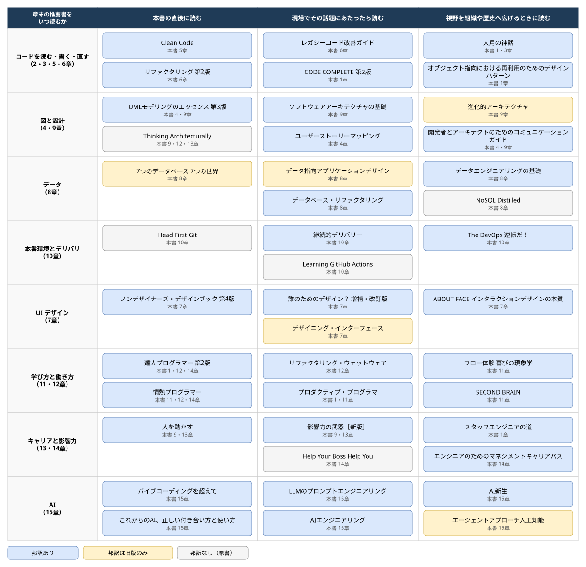

# 「ソフトウェアエンジニアリングの基礎」から見る読書マップ

## はじめに

『Fundamentals of Software Engineering: From Coder to Engineer』を読み終えました。O'Reilly Media の原書は2025年11月の刊行で、日本語版『ソフトウェアエンジニアリングの基礎 ―コーダーからエンジニアになるための実践ガイド』（村上列訳、オライリー・ジャパン）は2026年9月に出ました。私が読んだのはこの日本語版で、気になった箇所は原書の PDF と突き合わせています。

読みながら気になっていたのは、各章の末尾にある Additional Resources の節でした。本書はどの話題も入門の深さにとどめています。その代わり、章ごとに数冊の本を挙げ、序文では「気になった章があれば、その話題へ飛び込んでほしい」と誘導しています。1章の演習には、目次を眺めて弱い領域を選び、その章の Additional Resources を読むように、とまで書かれています。入門書として読み終えた時点で、次に読む本の地図が手元に残る構造です。

この記事では、まず本書の概要と読み終えての評価を書きます。そのあとで章末に挙げられた書籍を洗い出し、どれをどの順に読むかを1枚の図にまとめます。

## どんな本か

著者は Nathaniel Schutta と Dan Vega の2人です。序文によれば、想定読者は新人のソフトウェアエンジニアで、大学やブートキャンプで教わることと、現場で必要になることの隙間を埋める「オンボーディングガイド」として書かれています。

全体は4部15章です。第1部はコードを読む・書くといった中核のスキル、第2部はモデリングやテストなどの技術プラクティス、第3部は UI、データ、アーキテクチャ、本番環境といった設計と構築、第4部は生産性、学び方、ソフトスキル、キャリア、AI という職業人としての成長を扱います。

各章の構成は共通で、本文のあとに Wrapping Up、Putting It into Practice、Additional Resources の3節が続きます。Putting It into Practice は演習で、たとえば1章では「バグや機能を割り当てられたら、コードに飛びつく前の30分を調べものに使う」といった、すぐ試せる課題が並びます。Additional Resources がこの記事の主題で、書籍、記事、講演、ツールが章ごとに3件から十数件挙がっています。

章の厚みには偏りがあります。原書の目次から各章の開始ページの差を取ると、次のようになります。

| 章                                    | ページ数 |
| ------------------------------------- | -------- |
| 8章 Working with Data                 | 46       |
| 10章 To Production                    | 40       |
| 14章 Career Management                | 36       |
| 6章 Exploring and Modifying Systems   | 30       |
| 7章 User Interface Design             | 30       |
| 15章 The AI-Powered Software Engineer | 30       |
| 2章 Reading Code                      | 22       |
| 3章から5章、9章、12章、13章           | 各18     |
| 1章 Programmer to Engineer            | 14       |
| 11章 Powering Up Your Productivity    | 14       |

データと本番環境の2章で全体の4分の1近くを占めます。著者が新人に足りないと見ている領域は、ここに表れていると読みました。

## 読み終えて

一言でいえば、新人研修と現場の間をつなぐ本でした。研修ではバージョン管理やテストを「やるもの」として教わりますが、なぜやるのかは説明されないまま現場に出ます。私自身、バージョン管理を理由も教わらずに使わされ、あとから自分で理解した口です。本書は、その「なぜ」を、現場へ出る前にまとめて渡してくれます。

2章と3章の順序がまずよいと思いました。「読む」が「書く」より先に来ています。2章には、他人のコードを読むときの認知バイアスの話があります。先輩のコードを「ひどい」と言いながら読んでいた若いころを思い出し、身に覚えしかありませんでした。私はコードの読み方そのものを教わった記憶がありません。

6章の未知のシステムの探索では、「内製のフレームワークとライブラリを特定する」という節が特によいと感じました。何が標準で何が独自かを見極める、という視点です。実際に現場で苦労したのは、独自のもののほうでした。新人のときに本章があれば、と思います。

8章のデータは、私が1年目に SQL しか知らず、O/R マッパやコネクションプールの存在すら知らずに苦労した領域でした。8章を読んで、ACID の一貫性と CAP 定理や結果整合性の一貫性が別物だと初めて整理できました。一貫性モデル、キャッシュ戦略、スケーリング、データ移行と、トピックの選び方が的確で、この構成を自分で組める気がしません。

9章のアーキテクチャには「なりゆきのアーキテクト」というコラムがあります。アーキテクトの肩書きがなくてもアーキテクチャの仕事をしている人は多い、という話で、私も望んでなったわけではなく、見なければならなくて必然的にそうなりました。章の内容は『ソフトウェアアーキテクチャの基礎』を凝縮したもので、あの本への入り口として読めます。

10章の本番環境は、環境固有の設定、フィーチャーフラグ、セキュリティ、コンプライアンス、デプロイ戦略と、かなり網羅的でした。これを全部「本番環境へ」の一章で扱うのか、とも思いましたが、知っておくべきことが並んでいます。グレースフルデグラデーション（一部が壊れても全体を落とさず、機能を段階的に落として動き続けること）という概念は、10章で初めて知りました。

13章のソフトスキルには、「人間は技術ほど速くは変わらないから、ソフトスキルは時代遅れにならない」という一節があります。説得のやり方を「ハンマー」と「忍者」にたとえるのもおもしろく、同じ TDD の話を新人がしても通らず、社歴の長い人がしたら絶賛された、というコラムには現場のリアリティがありました。

14章のキャリアでは、選択肢そのものを並べて見せてくれます。「5年後にどうなりたいか」とはよく聞かれましたが、どういう選択肢があるのかが分からない状態が長く続いていたので、14章は新人のころの自分に読ませたいものでした。

一方で、4章のモデリングと5章の自動テストでは、私にとって新しい発見はありませんでした。ただ、カバレッジは虚栄の指標だという整理や、テストピラミッドの各層の説明は、基本的な概念をそろえ直す意味で読む価値がありました。

扱っていないこともあります。Infrastructure as Code には索引にも項目がなく、設定のコード化や DB スキーマのバージョン管理は扱うのに、インフラのコード化には踏み込みません。チームマネジメントも出てきません。13章のソフトスキルは個人が周囲と協働する視点で書かれ、14章でエンジニアリングマネージャーはキャリアの選択肢として紹介されるだけです。本は一貫して個人としてのエンジニアの視点に閉じています。また、デプロイ戦略の分類が章内でそろっていない、configuration management を設定ファイル周りの狭い意味で使っている、といった用語の整理の甘さも何ヵ所かありました。

それでも、入門書としての評価は変わりません。読むタイミングとしては、新人研修を終えて現場に出る直前か直後を推します。6章、8章、10章に書かれていることで困ったのは、ちょうどその時期でした。

## 著者の2人

共感した本の著者が何者なのかは、読み終えると気になるものです。巻末の著者紹介と本人のサイトや講演者プロフィールから、2人の経歴を調べました。

Nathaniel Schutta は Thoughtworks のソフトウェアアーキテクトで、2024年4月に Pivotal と VMware を経て移っています。1990年代後半にキャリアを始め、2005年の『Foundations of Ajax』を皮切りに、Neal Ford と Matthew McCullough との共著『Presentation Patterns』（2012年）、O'Reilly のレポート『Thinking Architecturally』（2018年）と『Responsible Microservices』（2020年）を書いています。本書の9章、12章、13章で『Thinking Architecturally』が挙がるのは、本人の著作だからです。2023年には Java Champion に選ばれ、No Fluff Just Stuff をはじめとするカンファレンスの常連講演者でもあります。そしてミネソタ大学の非常勤教授として、学生に「技術の変化を受け入れ、かつ評価すること」を教えています。

Dan Vega は Broadcom の Spring Developer Advocate です。1996年に独学でプログラミングを始め、2000年に地元のカレッジを出てサンフランシスコのスタートアップに入り、その後クリーブランドに戻って複数の企業で開発を続けました。途中、コーディングブートキャンプの Tech Elevator でカリキュラム開発を担当しています。2022年1月から VMware の Spring Developer Advocate を務め、Broadcom による買収後も同じ役割を続けています。2024年には Java Champion に選ばれました。YouTube チャンネルの登録者は2026年10月時点で約32万人、Udemy の受講者は約16万人で、週刊のニュースレターと Spring Office Hours というポッドキャストも持っています。本書が初めての書籍です。

2人の経歴を並べて気付いたのは、序文の図が示す「教わること」と「必要なこと」の隙間の両側に、それぞれが立っていることでした。Schutta は大学で教える側、Vega はブートキャンプのカリキュラムを作る側を経験し、どちらも現場で25年以上開発を続けています。本書が隙間を埋める本として書けたのは、2人がその隙間を教室と現場の両方から見てきたからだと思います。4章にあった、図を印刷して壁に貼っていた時代の記述に好感を持ったのも、この経歴を知ると腑に落ちます。

## 章末に挙げられた本

Additional Resources に挙がる資料は、書籍のほかに記事、講演、ツール、Web サイトを含みます。ここでは書籍だけを洗い出しました。記事と講演（Jack Reeves の「Code as Design」、Rich Hickey の「Simple Made Easy」、Paul Graham の「Maker's Schedule, Manager's Schedule」など）、ツール（JUnit 5、Mockito、AssertJ など）、Web サイト（C4 model、Thoughtworks Technology Radar など）は表から外しています。

同じ本が複数の章で挙がることがあります。3つの章で挙がるのは『達人プログラマー』、『情熱プログラマー』、そして Schutta 自身のレポート『Thinking Architecturally』の3冊でした。2つの章で挙がる本は『人月の神話』、『プロダクティブ・プログラマ』、『人を動かす』、『影響力の武器』と、4章と9章の両方に挙がる図の本3冊（『UMLモデリングのエッセンス』、『開発者とアーキテクトのためのコミュニケーションガイド』、Ashley Peacock の『Creating Software with Modern Diagramming Techniques』）です。

書籍は全部で55冊でした。邦訳の有無と書誌は2026年10月時点で確認したものです。原書の版と邦訳の版がずれている本は、邦訳の欄にそう書いています。

章末に挙げられた書籍の一覧（55冊）

| 原書                                                        | 著者                                  | 原書刊行年        | 邦訳（出版社、刊行年）                                                                  | 本書の章     | ひとこと                                                                          |
| ----------------------------------------------------------- | ------------------------------------- | ----------------- | --------------------------------------------------------------------------------------- | ------------ | --------------------------------------------------------------------------------- |
| The Pragmatic Programmer, 20th Anniversary Edition          | David Thomas、Andrew Hunt             | 2019（初版 1999） | 『達人プログラマー 第2版』オーム社、2020                                                | 1・12・14章  | 職業プログラマーの心構えと習慣を網羅した定番                                      |
| The Mythical Man-Month, Anniversary Edition                 | Fred Brooks                           | 1995（初版 1975） | 『人月の神話【新装版】』丸善出版、2014                                                  | 1・3章       | 人を増やしても遅れる、という古典。1章と15章に挙がる論文「No Silver Bullet」も収録 |
| Design Patterns                                             | Erich Gamma ほか                      | 1994              | 『オブジェクト指向における再利用のためのデザインパターン 改訂版』SBクリエイティブ、1999 | 1章          | GoF の23パターン                                                                  |
| Practices of an Agile Developer                             | Venkat Subramaniam、Andy Hunt         | 2006              | 『アジャイルプラクティス』オーム社、2007                                                | 1章          | 現場開発者の45の習慣                                                              |
| The Productive Programmer                                   | Neal Ford                             | 2008              | 『プロダクティブ・プログラマ』オライリー・ジャパン、2009                                | 1・11章      | 開発者個人の生産性を道具と習慣から上げる                                          |
| Software Engineering at Google                              | Titus Winters ほか編                  | 2020              | 『Googleのソフトウェアエンジニアリング』オライリー・ジャパン、2021                      | 1章          | 組織規模での文化、プロセス、ツール                                                |
| The Staff Engineer's パス                                   | Tanya Reilly                          | 2022              | 『スタッフエンジニアの道』オライリー・ジャパン、2024                                    | 1章          | マネジメントに進まない上級技術職の道                                              |
| Code Complete, 2nd Edition                                  | Steve McConnell                       | 2004              | 『CODE COMPLETE 第2版』上下、日経BP、2005                                               | 1章          | コード構築の実践を網羅した大著                                                    |
| User Story Mapping                                          | Jeff Patton                           | 2014              | 『ユーザーストーリーマッピング』オライリー・ジャパン、2015                              | 4章          | 要求を地図として並べる手法                                                        |
| Communication Patterns                                      | Jacqui Read                           | 2023              | 『開発者とアーキテクトのためのコミュニケーションガイド』オライリー・ジャパン、2025      | 4・9章       | 図と文書で技術を伝えるパターン集                                                  |
| Creating Software with Modern Diagramming Techniques        | Ashley Peacock                        | 2023              | なし                                                                                    | 4・9章       | Mermaid などコードとして書く図                                                    |
| UML Distilled, 3rd Edition                                  | Martin Fowler                         | 2003              | 『UMLモデリングのエッセンス 第3版』翔泳社、2005                                         | 4・9章       | UML の要点を薄くまとめた入門                                                      |
| Clean Code                                                  | Robert C. Martin                      | 2008              | 『Clean Code』KADOKAWA、2017（初刊 2009）                                               | 5章          | 読みやすいコードの規律                                                            |
| Refactoring, 2nd Edition                                    | Martin Fowler                         | 2018              | 『リファクタリング 第2版』オーム社、2019                                                | 6章          | 振る舞いを変えずに構造を直すカタログ                                              |
| Working Effectively with Legacy Code                        | Michael Feathers                      | 2004              | 『レガシーコード改善ガイド』翔泳社、2009                                                | 6章          | テストのないコードにテストを入れる技法                                            |
| Getting to Know IntelliJ IDEA                               | Trisha Gee、Helen Scott               | 2022              | なし                                                                                    | 6章          | IDE の機能を体系的に学ぶ                                                          |
| The Design of Everyday Things, Revised and Expanded Edition | Don Norman                            | 2013（初版 1988） | 『誰のためのデザイン？ 増補・改訂版』新曜社、2015                                       | 7章          | アフォーダンスなど認知科学からのデザイン原論                                      |
| The Non-Designer's Design Book, 4th Edition                 | Robin Williams                        | 2014              | 『ノンデザイナーズ・デザインブック 第4版』マイナビ出版、2016                            | 7章          | 近接、整列、反復、コントラストの4原則                                             |
| About Face, 4th Edition                                     | Alan Cooper ほか                      | 2014              | 『ABOUT FACE インタラクションデザインの本質』マイナビ出版、2024                         | 7章          | ゴール指向のインタラクションデザイン                                              |
| Designing Interfaces, 3rd Edition                           | Jenifer Tidwell ほか                  | 2019              | 第2版のみ『デザイニング・インターフェース 第2版』オライリー・ジャパン、2011             | 7章          | UI パターンのカタログ                                                             |
| Designing Data-Intensive Applications, 2nd Edition          | Martin Kleppmann、Chris Riccomini     | 2026              | 第1版のみ『データ指向アプリケーションデザイン』オライリー・ジャパン、2019               | 8章          | 分散データシステムの原理                                                          |
| Seven Databases in Seven Weeks, 2nd Edition                 | Luc Perkins ほか                      | 2018              | 初版のみ『7つのデータベース 7つの世界』オーム社、2013                                   | 8章          | 7種のデータベースを手を動かして比べる                                             |
| Refactoring Databases                                       | Scott Ambler、Pramod Sadalage         | 2006              | 『データベース・リファクタリング』ピアソン・エデュケーション、2008                      | 8章          | 稼働中のスキーマを段階的に変える                                                  |
| Fundamentals of Data Engineering                            | Joe Reis、Matt Housley                | 2022              | 『データエンジニアリングの基礎』オライリー・ジャパン、2024                              | 8章          | データ基盤のライフサイクル全体                                                    |
| NoSQL Distilled                                             | Pramod Sadalage、Martin Fowler        | 2012              | なし                                                                                    | 8章          | NoSQL の分類と使い分けの薄い入門                                                  |
| Thinking Architecturally                                    | Nathaniel Schutta                     | 2018              | なし                                                                                    | 9・12・13章  | 著者自身の無料レポート。技術の変化をどう評価するか                                |
| Head First Software Architecture                            | Raju Gandhi、Mark Richards、Neal Ford | 2024              | なし                                                                                    | 9章          | アーキテクチャ入門の Head First 版                                                |
| Fundamentals of Software Architecture                       | Mark Richards、Neal Ford              | 2020              | 『ソフトウェアアーキテクチャの基礎』オライリー・ジャパン、2022（第2版の邦訳は 2026）    | 9章          | トレードオフ分析とアーキテクチャスタイル                                          |
| How to Win Friends and Influence People                     | Dale Carnegie                         | 1936              | 『人を動かす 改訂新装版』創元社、2023                                                   | 9・13章      | 対人関係の古典                                                                    |
| Building Evolutionary Architectures, 2nd Edition            | Neal Ford ほか                        | 2022              | 初版のみ『進化的アーキテクチャ』オライリー・ジャパン、2018                              | 9章          | 適応度関数で変化に耐える設計                                                      |
| Influence, New and Expanded                                 | Robert Cialdini                       | 2021              | 『影響力の武器［新版］』誠信書房、2023                                                  | 9・13章      | 説得の心理学の7原理                                                               |
| Continuous Delivery                                         | Jez Humble、David Farley              | 2010              | 『継続的デリバリー』KADOKAWA、2017（初刊 2012）                                         | 10章         | ビルドからリリースまでを自動化するパイプラインの原典                              |
| The Phoenix Project                                         | Gene Kim ほか                         | 2013              | 『The DevOps 逆転だ！』日経BP、2014                                                     | 10章         | 小説仕立てで DevOps を描く                                                        |
| Head First Git                                              | Raju Gandhi                           | 2022              | なし                                                                                    | 10章         | Git のしくみから学ぶ入門                                                          |
| Learning GitHub Actions                                     | Brent Laster                          | 2023              | なし                                                                                    | 10章         | GitHub Actions による CI/CD                                                       |
| Feature Flags                                               | Ben Nadel                             | 2024              | なし                                                                                    | 10章         | フィーチャーフラグの運用に絞った自費出版                                          |
| Flow                                                        | Mihaly Csikszentmihalyi               | 1990              | 『フロー体験 喜びの現象学』世界思想社、1996                                             | 11章         | 没頭状態の心理学                                                                  |
| Building a Second Brain                                     | Tiago Forte                           | 2022              | 『SECOND BRAIN』東洋経済新報社、2023                                                    | 11章         | 個人の知識管理の方法論                                                            |
| The Passionate Programmer, 2nd Edition                      | Chad Fowler                           | 2009              | 『情熱プログラマー』オーム社、2010                                                      | 11・12・14章 | 開発者のキャリアを自分で作る53の助言                                              |
| The First 20 Hours                                          | Josh Kaufman                          | 2013              | 『たいていのことは20時間で習得できる』日経BP、2014                                      | 12章         | スキル獲得の最初の20時間の使い方                                                  |
| Pragmatic Thinking and Learning                             | Andy Hunt                             | 2008              | 『リファクタリング・ウェットウェア』オライリー・ジャパン、2009                          | 12章         | 脳のしくみから見た学習法                                                          |
| Developer Career マスタplan                                 | Heather VanCura、Bruno Souza          | 2023              | なし                                                                                    | 14章         | コミュニティ参加を軸にしたキャリア設計                                            |
| The Manager's パス                                          | Camille Fournier                      | 2017              | 『エンジニアのためのマネジメントキャリアパス』オライリー・ジャパン、2018                | 14章         | テックリードから CTO までの各段階                                                 |
| Developer, Advocate!                                        | Geertjan Wielenga                     | 2019              | なし                                                                                    | 14章         | デベロッパーアドボケイトへのインタビュー集                                        |
| Help Your Boss Help You                                     | Ken Kousen                            | 2021              | なし                                                                                    | 14章         | 上司との関係を自分から作る                                                        |
| Never Eat Alone                                             | Keith Ferrazzi、Tahl Raz              | 2014（初版 2005） | 2005年版の邦訳『一生モノの人脈力』パンローリング、2012                                  | 14章         | 人脈づくりの実用書                                                                |
| AI Engineering                                              | Chip Huyen                            | 2024              | 『AIエンジニアリング』オライリー・ジャパン、2025                                        | 15章         | 基盤モデルを使うアプリケーション開発                                              |
| Beyond Vibe Coding                                          | Addy Osmani                           | 2025              | 『バイブコーディングを超えて』オライリー・ジャパン、2025                                | 15章         | AI 支援開発とエンジニアの役割                                                     |
| Prompt Engineering for LLMs                                 | John Berryman、Albert Ziegler         | 2024              | 『LLMのプロンプトエンジニアリング』オライリー・ジャパン、2025                           | 15章         | GitHub Copilot の開発者によるプロンプト設計                                       |
| Rebooting AI                                                | Gary Marcus、Ernest Davis             | 2019              | なし                                                                                    | 15章         | 深層学習一辺倒への批判                                                            |
| Co-Intelligence                                             | Ethan Mollick                         | 2024              | 『これからのAI、正しい付き合い方と使い方』KADOKAWA、2024                                | 15章         | AI と協働する4つの原則                                                            |
| Human Compatible                                            | Stuart Russell                        | 2019              | 『AI新生』みすず書房、2021                                                              | 15章         | 人間と両立する AI の制御問題                                                      |
| Artificial Intelligence: A Modern Approach, 4th Edition     | Stuart Russell、Peter Norvig          | 2020              | 第2版のみ『エージェントアプローチ人工知能 第2版』共立出版、2008                         | 15章         | AI の標準教科書                                                                   |
| Deep Learning with Python, 2nd Edition                      | François Chollet                      | 2021              | 『Pythonによるディープラーニング』マイナビ出版、2022                                    | 15章         | Keras の作者による入門                                                            |
| Taming Silicon Valley                                       | Gary Marcus                           | 2024              | 『AIテックを抑え込め！』日経BP、2025                                                    | 15章         | AI 企業への規制を論じる                                                           |

## どれから読むか

表のままでは50冊近くあり、どこから手を付けるか決められません。そこで2つの軸で並べ直しました。

縦の軸は話題で、本書の章をまとめたものです。コードを読む・書く・直す（2・3・5・6章）、図と設計（4・9章）、データ（8章）、本番環境とデリバリ（10章）、UI デザイン（7章）、学び方と働き方（11・12章）、キャリアと影響力（13・14章）、AI（15章）の8行です。

横の軸は読む時期です。「本書の直後に読む」には、本書と同じように広く浅く全体を見渡す本と、本書が複数の章で繰り返し挙げる本を置きました。「現場でその話題にあたったら読む」には、各話題の定番として深掘りに使える本を置きました。「視野を組織や歴史へ広げるときに読む」には、チームや組織の話、歴史的な古典、理論寄りの本を置きました。この振り分けは本書が示しているものではなく、本書の記述と私の経験から判断したものです。

青い枠は邦訳がある本、黄色の枠は邦訳が旧版にしかない本、灰色の枠は原書しかない本です。表に挙げた本のうち、記事や講演に近い薄いもの、同じ著者の重複、本書の主題から遠いものは図から落としています。

図の読み方として、まず1列目を横に通して読むのが、本書の読者には合うと思います。『達人プログラマー』と『情熱プログラマー』は本書と同じ粒度で、本書が3つの章で挙げるだけの理由があります。そのあとは、現場で当たった話題の行を2列目へ進めば、本書の章がその本の要約として働きます。9章と『ソフトウェアアーキテクチャの基礎』、10章と『継続的デリバリー』はその典型です。3列目は急がなくてよい本で、肩書きや役割が変わったときに戻ってくれば十分だと考えています。

## おわりに

本書の各章は入門の深さで止まりますが、章末の Additional Resources をたどれば次の一冊が決まります。1章の演習が言うように、目次を眺めて弱い領域を選び、その章の推薦書へ進む。それをやりやすくするために、この記事の表と図を作りました。

私自身がまず進むのは8章の行です。一貫性モデルとキャッシュ戦略を、本書の整理よりもう一段深く調べたいと思っています。
